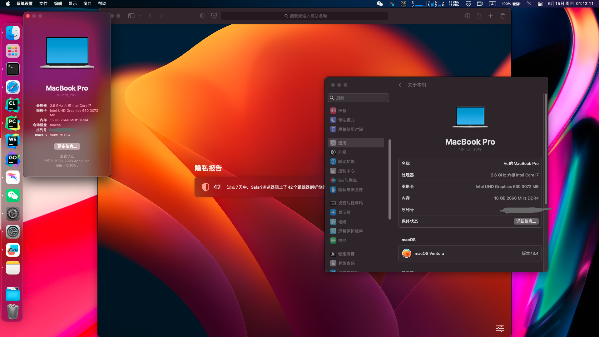

# Dell-Inspiron-7590-Ventura

- Dell-Inspiron-7590 （4K与HDMI由于没机器未测试，4K理论上没问题，HDMI需要自行测试）
 
- OC: 0.9.1
 
- macOS Ventura 13.4 (22F66)
 
- 启动第二阶段黑屏已修复，睡眠唤醒问题修复，蓝牙-wifi正常可用
  
- 小问题： 睡眠锁定后，唤醒亮屏解锁，偶尔出现蓝牙键盘不能输入，用笔记本键盘解锁后正常使用

**等待Macos Sonoma 14.5发布**

---

## Desktop

---

## Macos12.5 

https://github.com/6923403/Dell-Inspiron-7590-Monterey
